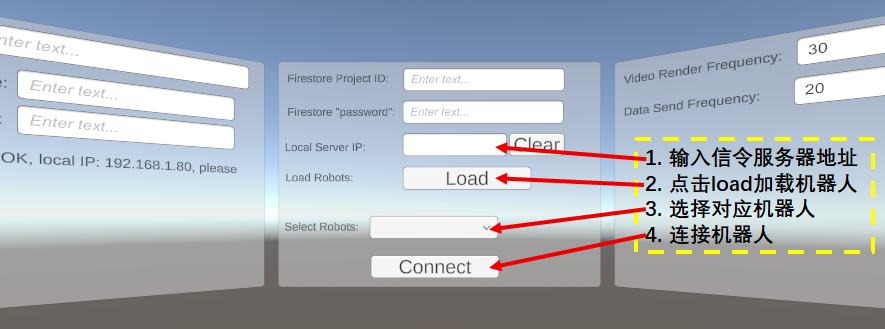

# 安装 


```bash
git clone https://github.com/RAI-ZZU/quest-api.git
cd  quest-api/
pip install -e .
```

# 测试

1. 替换信令服务器地址，修改`signalingSettings.json`
    ```
    {
    "robotID": "H1", # 机器人名称
    "password": "zzu_rai", # 密码没用到
    "signal_server_url": "http://***:5000",   # 这里***替换为信令服务器地址，下面的内容不用管
    "turn_server_url": "<turn url>",
    "turn_server_username": "<turn username>",
    "turn_server_password": "<turn password>"
    }
    ```
2. 运行交互接口
    ```bash
    cd quest-api/quest/
    python webrtc_headset.py
    ```

3. 运行quest中对应的应用，按照以下步骤进行操作

